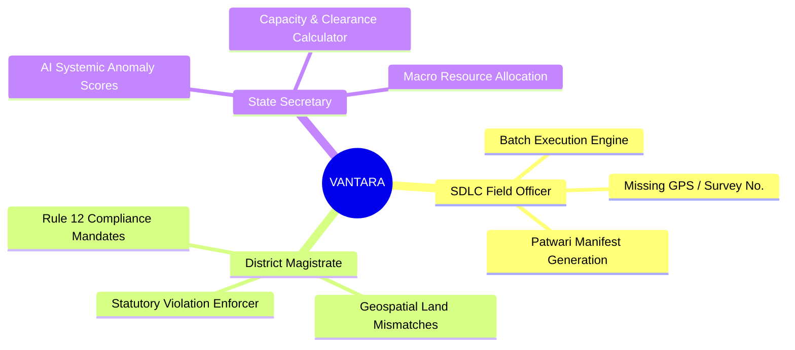
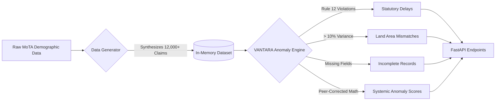
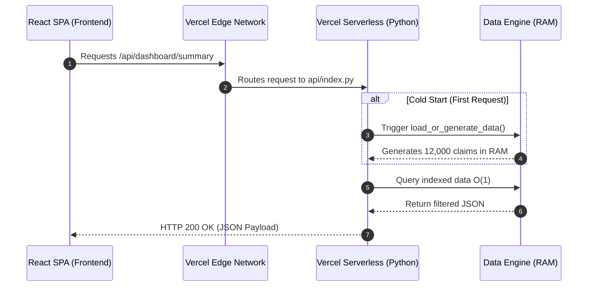

<div align="center">

# 🌳 VANTARA

**Verified Anomaly Navigation & Tracking for Adivasi Rights Administration**

[](https://reactjs.org/)
[](https://vitejs.dev/)
[](https://tailwindcss.com/)
[](https://fastapi.tiangolo.com/)
[](https://www.python.org/)
[](https://opensource.org/licenses/MIT)

*An AI-driven operational intelligence platform designed to eliminate bureaucratic stagnation and enforce the Forest Rights Act (FRA), 2006.*

[**🚀 View Live Deployment on Vercel**](https://vantara-nakshatra.vercel.app/) • [**📖 Read the Docs**](docs/ARCHITECTURE.md) • [**🐛 Report a Bug**](https://github.com/aaditya8979/Vantara/issues)

</div>

---

## 📖 Executive Summary

The Forest Rights Act (FRA) of 2006 is a landmark legislation in India, but its implementation is plagued by severe bureaucratic bottlenecks, missing documentation, and systemic land mismatches. 

**VANTARA** is not just another dashboard. It is an **asymmetric, role-based resolution engine**. It strictly adheres to NIC digital standards and mathematically identifies whether a district's failure is due to individual incompetence or systemic, structural breakdowns.

<br/>

## 🏛️ Asymmetric Role-Based Architecture

VANTARA acknowledges that a District Magistrate needs different tools than a State Secretary. The platform bifurcates data based on the statutory powers of the viewer:



### 1. SDLC Field Officer (Administrative Resolution)
*The Ground Level: High-throughput batch processing.*
- **Batch Execution Engine**: Instantly filters thousands of claims missing basic fields (Survey Numbers, GPS Coordinates).
- **Automated Manifests**: Select multiple claims to auto-generate printable Patwari Survey Batches and Gram Sabha GPS Checklists.

### 2. District Magistrate / DLC (Legal Enforcement)
*The Enforcer: Resolving structural land conflicts and delays.*
- **Geospatial Tracking**: Dedicated Leaflet map locked to the district, highlighting hotspots of statutory violations and land mismatches.
- **Priority Action Queue**: Identifies claims stuck beyond the 60-day statutory limit.
- **One-Click Legal Directives**: Auto-generates official, printable **Rule 12(2) Compliance Mandates**.

### 3. State Tribal Secretary (Resource Allocation)
*The Strategist: Macro-strategy, capacity building, and systemic analysis.*
- **District Performance Matrix**: Ranks districts not just by pending claims, but by a peer-corrected **Anomaly Score** identifying systemic vs. individual bottlenecks.
- **SDLC Clearance Calculator**: A dynamic tool that calculates required claims-processed-per-month rates to hit target clearance timelines.

<br/>

## 🧠 The Anomaly Engine & Synthetic Data

VANTARA is powered by a highly sophisticated Python data generator that accurately models the grim realities of bureaucratic stagnation.



### Deep-Dive: Deterministic Anomaly Scoring
The backend calculates a **Systemic Anomaly Score** for each district by:
1. Finding a cohort of peer districts with similar tribal populations and forest coverage.
2. Calculating the standard deviation of settlement rates among peers.
3. Flagging districts that fall more than `2.0 σ` below their peer average.
4. Categorizing bottlenecks into `INDIVIDUAL` (correctable) vs `SYSTEMIC` (requiring state intervention).

<br/>

## 🏗️ System Architecture

VANTARA operates as a highly decoupled, serverless architecture deployed entirely on Vercel.



- **Why Vercel Serverless?** Zero-maintenance scaling. The backend scales instantly to zero when unused and scales up infinitely during traffic spikes, perfect for government portals.
- **Why In-Memory Data?** Vercel Serverless Functions are read-only. Generating data entirely in-memory avoids costly I/O operations and bypasses AWS Lambda's `Read-Only File System` restrictions, ensuring 100% uptime.

<br/>

## 🛠️ Local Development Setup

### Prerequisites
- Node.js (v18+)
- Python (3.11+)

### 1. Start the Backend (FastAPI)
```bash
git clone https://github.com/aaditya8979/Vantara.git
cd Vantara/api
python -m venv venv
source venv/bin/activate  # On Windows: venv\Scripts\activate
pip install -r requirements.txt

# Run the local dev server
uvicorn index:app --reload --port 8000
```
*The backend will run on `http://localhost:8000`*

### 2. Start the Frontend (React/Vite)
Open a new terminal window:
```bash
cd Vantara/frontend
npm install
npm run dev
```
*The frontend will run on `http://localhost:5173`*

<br/>

## 📁 Repository Structure

```
├── api/                        # FastAPI serverless backend (Vercel)
│   ├── index.py                # Main API entry point & Routing
│   ├── _anomaly_engine.py      # Deterministic anomaly detection logic
│   ├── _data_generator.py      # Synthetic data generation logic
│   └── requirements.txt        # Python dependencies
├── frontend/                   # React + Vite + TypeScript frontend
│   ├── src/
│   │   ├── components/         # React components (Dashboards, Maps, Tables)
│   │   ├── api.ts              # Centralized API fetch client with JSDoc
│   │   ├── types.ts            # Shared TypeScript interfaces
│   │   ├── App.tsx             # Routing configuration
│   │   └── main.tsx            # React DOM entry point
│   └── package.json            # Node.js dependencies
├── docs/                       # Comprehensive System Documentation
├── .github/workflows/          # CI/CD Pipelines for Linting & Build
└── vercel.json                 # Vercel Deployment Configuration
```

<br/>

## 🤝 Community & Support

We welcome contributions from developers, designers, and policy experts.
- Read our [Contributing Guidelines](CONTRIBUTING.md)
- Review our [Code of Conduct](CODE_OF_CONDUCT.md)
- Report vulnerabilities via our [Security Policy](SECURITY.md)

<br/>

<div align="center">
  <sub>Built with ❤️ for the Adivasi Rights Administration Hackathon</sub><br/>
  <sup>Licensed under the <a href="LICENSE">MIT License</a></sup>
</div>
