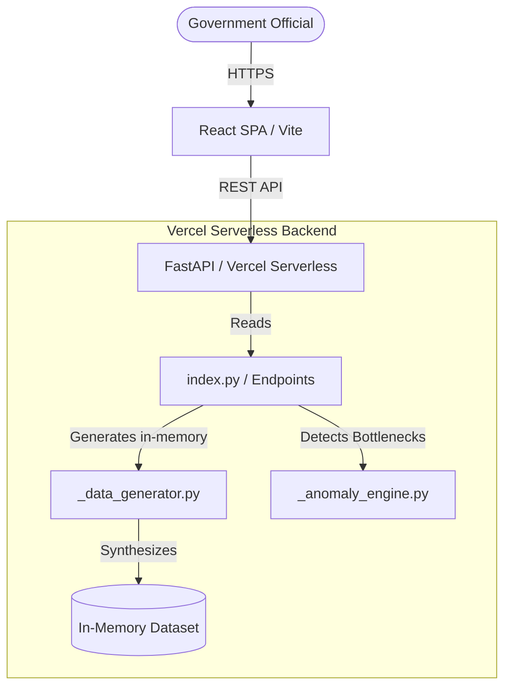

# 🌳 VANTARA

**Verified Anomaly Navigation & Tracking for Adivasi Rights Administration**

[](https://reactjs.org/)
[](https://vitejs.dev/)
[](https://tailwindcss.com/)
[](https://fastapi.tiangolo.com/)
[](https://www.python.org/)
[](https://opensource.org/licenses/MIT)

VANTARA is an operational intelligence platform designed for government officials to monitor, enforce, and clear bottlenecks in the implementation of the **Forest Rights Act (FRA), 2006**. 

Built with strict adherence to Indian Government (NIC) digital standards, VANTARA moves beyond simple dashboards to provide an **asymmetric, role-based resolution engine** tailored to the specific legal powers of different government tiers.

## 🚀 Live Demo
> **[View the Live Deployment on Vercel](https://vantara-nakshatra.vercel.app/)**

---

## 🏗️ Architecture

VANTARA operates as a decoupled architecture powered by FastAPI on Vercel Serverless Functions and a React Single Page Application (SPA).



For more detailed technical documentation, see the [Architecture Guide](docs/ARCHITECTURE.md).

---

## ✨ Core Features: Asymmetric Role-Based Architecture

Rather than showing the same generic data to everyone, VANTARA provides specialized tools for each level of administration:

### 1. SDLC Field Officer (Administrative Resolution)
*Focus: Processing incomplete records and field verification.*
- **Batch Execution Engine**: Instantly filters thousands of claims missing basic fields (Survey Numbers, GPS Coordinates).
- **Automated Manifests**: Select multiple claims to auto-generate printable Patwari Survey Batches and Gram Sabha GPS Checklists.
- **High-Density Data**: Clean, tabular interface built for high-throughput batch processing without map distractions.

### 2. District Magistrate / DLC (Legal Enforcement)
*Focus: Enforcing statutory deadlines and resolving structural land conflicts.*
- **Geospatial Tracking**: Dedicated Leaflet map locked to the district, highlighting hotspots of statutory violations and land mismatches.
- **Priority Action Queue**: Identifies claims stuck beyond the 60-day statutory limit or facing severe land area discrepancies.
- **One-Click Legal Directives**: Auto-generates official, printable **Rule 12(2) Compliance Mandates**.

### 3. State Tribal Secretary (Resource Allocation)
*Focus: Macro-strategy, capacity building, and identifying systemic failures.*
- **District Performance Matrix**: Ranks districts not just by pending claims, but by an AI-driven **Anomaly Score**.
- **SDLC Clearance Calculator**: A dynamic tool where the Secretary sets a "Target Clearance" timeline to calculate required processing rates.

---

## 📁 Project Structure

```
├── api/                        # FastAPI serverless backend (Vercel)
│   ├── index.py                # Main API entry point & Routing
│   ├── _anomaly_engine.py      # Deterministic anomaly detection logic
│   ├── _data_generator.py      # Synthetic data generation logic
│   └── requirements.txt        # Python dependencies
├── frontend/                   # React + Vite + TypeScript frontend
│   ├── src/
│   │   ├── components/         # React components (Dashboards, Maps, Tables)
│   │   ├── api.ts              # Centralized API fetch client
│   │   ├── types.ts            # Shared TypeScript interfaces
│   │   ├── App.tsx             # Routing configuration
│   │   └── main.tsx            # React DOM entry point
│   └── package.json            # Node.js dependencies
├── docs/                       # Project Documentation
├── .github/workflows/          # CI/CD Pipelines
└── vercel.json                 # Vercel Deployment Configuration
```

---

## 📖 API Documentation

The backend exposes a comprehensive RESTful API for querying FRA claims and generating metrics. 
For a complete list of endpoints, see the [API Documentation](docs/API.md).

---

## 🛠️ Local Setup & Development

### Prerequisites
- Node.js (v18+)
- Python (3.11+)

### 1. Start the Backend (FastAPI)
```bash
cd api
python -m venv venv
source venv/bin/activate  # On Windows: venv\Scripts\activate
pip install -r requirements.txt

# Run the local dev server
uvicorn index:app --reload --port 8000
```
*The backend will run on `http://localhost:8000`*

### 2. Start the Frontend (React/Vite)
Open a new terminal window:
```bash
cd frontend
npm install
npm run dev
```
*The frontend will run on `http://localhost:5173`*

---

## 🔐 Environment Variables

| Variable | Location | Description | Required |
|----------|----------|-------------|----------|
| `VITE_API_BASE` | `frontend/.env` | Override API base URL (e.g., `http://localhost:8000/api`) | No (defaults to `/api`) |

---

## 🤝 Contributing

We welcome contributions! Please review our:
- [Contributing Guidelines](CONTRIBUTING.md)
- [Code of Conduct](CODE_OF_CONDUCT.md)
- [Security Policy](SECURITY.md)

---

## 📄 License

VANTARA is open-source software licensed under the [MIT License](LICENSE).
