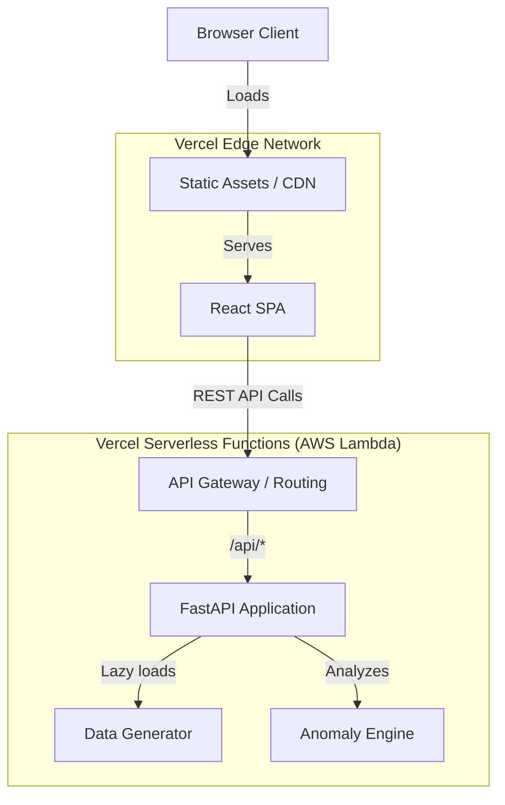

# VANTARA System Architecture

## Overview

VANTARA is a decoupled web application built on modern serverless infrastructure. It utilizes **FastAPI** for a robust, python-based backend and **React (Vite/TypeScript)** for a highly interactive, typed frontend.

## Deployment Architecture

The entire application is deployed as a monorepo on **Vercel**. 

- **Frontend:** Vercel automatically builds the `frontend/` directory using Vite and serves it globally on the Edge Network.
- **Backend:** Vercel automatically detects the `api/` directory and compiles the Python files into AWS Lambda Serverless Functions.

## Data Flow

VANTARA currently uses a **deterministic synthetic data generator** to simulate real-world conditions without storing actual sensitive data.

1. **Cold Start (Lazy Loading)**: On the first API request to a new serverless function instance, `index.py` triggers the lazy loading mechanism.
2. **In-Memory Generation**: The `_data_generator.py` script synthesizes 12,000+ claims across 30 districts directly into RAM.
3. **Anomaly Analysis**: The `_anomaly_engine.py` runs over the dataset, flagging statutory violations (Rule 12), land area mismatches, and computing peer-corrected anomaly scores for each district.
4. **Serving**: The in-memory dataset is indexed for fast O(1) lookups and O(N) aggregations to serve REST API responses within milliseconds.

## Key Design Decisions

- **Why Vercel Serverless?** Zero-maintenance scaling. The backend scales instantly to zero when unused and scales up infinitely during traffic spikes, perfect for government portals with localized traffic patterns.
- **Why In-Memory Data?** Vercel Serverless Functions are read-only. Generating data entirely in-memory avoids costly I/O operations and bypasses the `Read-Only File System` restrictions of AWS Lambda, ensuring 100% uptime.
- **Why TypeScript?** Strict typing across the frontend ensures zero runtime errors when parsing complex backend payloads (like `StageHistoryEntry` and `AnomalyFlag`).
